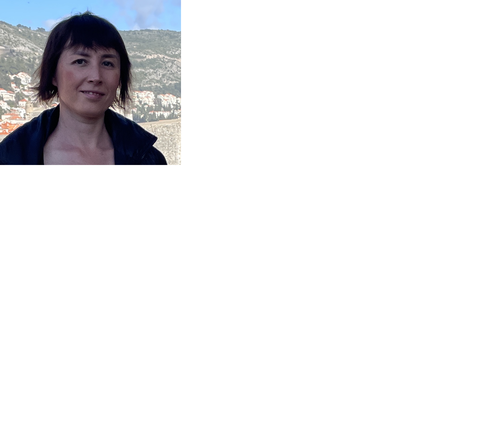

## Nataliia Herasymova
**************************
Ukraine, Kiev
**************************
Junior Frontend Developer
**************************
## Contact Information
* Phone +380665863673
* E-mail: Nataliia.Herasymova@gmail.com
* GitHub: Nataliia2203
* Telegram: @NataliiaGera
*********************************************
## About Me
I'm 36 years old. Now I'm chief ingineer of the project of electrical networks. 
But thirst of knowledge and desire for something new have led me to RSscool.
My goal is to get knowledge of frontend development and to change my field
of activity.
******************************************************************************
## My character traits
* responsibility
* purposefulness
* fast lerner
* punctuality
*********************************************************************************
## Skills
* HTML
* CSS
* Java Script (beginner)
* GitHub
* VS Code
*********************************************************************************
## Code Example
```
const repeat = (text, times)=> {
    let result = '';
    let i=1;
    while (i<=times>) {
        result = `${result}${text}`;
        i=i+1;
    }
    return result;
};
```
*************************************************************************************
## Education
* Kirovograd National Technical University, Electrical power consumtion systems from 2003 till 2008
* Courses - RS Scool Course "JavaScript/Front-end Stage 1" (in progress)
************************************************************************************
## Languages
* Ukrainian - native speaker
* Russian - native speaker
* English - B1 Intermediate
* Deutsch - A2 Elementary
*********************************************************************************